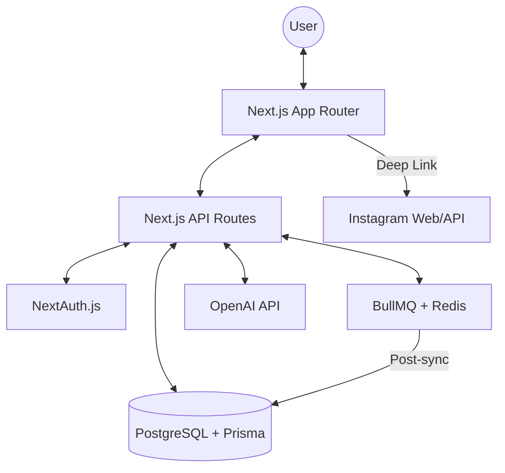

# Product Specification: InstaOutreachOS

## Overview
InstaOutreachOS is a compliant, human-in-the-loop Instagram outreach platform designed for marketers and agencies. It focuses on safety, efficiency, and scale without violating Instagram's policies.

## Terminology
- **Lead**: A potential Instagram contact.
- **Campaign**: A set of sequences and leads targeted with a specific goal.
- **Queue**: A daily list of assisted outreach tasks.
- **Assisted Outreach**: A workflow where the app prepares everything, but the user performs the final "Send" action on Instagram.

## System Architecture

## Core Features
1. **Workspace Multi-tenancy**: Organizations can manage multiple teams and projects.
2. **CRM & Lead Management**: High-performance lead tracking with pipeline stages.
3. **Sequence Builder**: Multi-step messaging templates with follow-up logic.
4. **Daily Outreach Queue**: Intelligent task distribution based on safety limits (e.g., max 20 tasks/day).
5. **AI Assistant**: Personalized message drafting based on bio and recent post text.
6. **Unified Inbox**: Manual logging of replies to update CRM state automatically.

## API Route List

### Auth
- `GET /api/auth/*`: NextAuth handlers

### Workspaces
- `GET/POST /api/workspaces`: List/Create workspaces
- `GET/PATCH /api/workspaces/[id]`: Manage workspace settings

### Leads
- `GET/POST /api/leads`: CRM lead management
- `POST /api/leads/import`: CSV upload and dedupe logic
- `PATCH /api/leads/[id]/stage`: Update pipeline stage

### Campaigns
- `GET/POST /api/campaigns`: Campaign management
- `POST /api/campaigns/[id]/sequence`: Update sequence steps

### Queue
- `GET /api/queue`: Fetch daily tasks
- `POST /api/queue/[taskId]/log`: Log task completion (Sent, Skipped)

### AI
- `POST /api/ai/personalize`: Generate personalized message draft

## Compliance & Safety
- **No Automation of Actions**: No bot-driven DMs or follows.
- **Rate Limiting**: Daily caps on task generation.
- **Human Safeguards**: Warnings for identical message templates.
- **No Password Storage**: Only official OAuth or manual link-based workflows.
